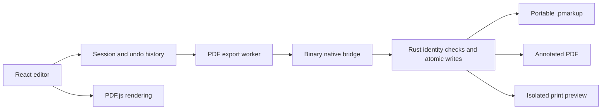

# Architecture

PDF Markup is a Windows desktop application, with a React/TypeScript editor in
Tauri's WebView2 frontend and Rust handling authorized local file operations.

- `src/components/`: controls, PDF navigation, raster tiles, vector overlays.
- `src/services/`: project schema, geometry, undo, preferences, loading/export.
- `src-tauri/src/`: portable container, scoped persistence, recents, printing.
- `tests/`: frontend unit/component tests; Rust tests live beside native code.
- `scripts/`: asset provisioning, release checks, checksums, benchmarks.

Coordinates are stored in PDF space. Rotation, crop boxes, user units, zoom,
and scrolling are handled at the view boundary. Overlays and export reuse
the same geometry/layout functions. Rendering bounds the full-page raster
and adds detail only for the visible area.

Committed annotations belong to the session. Pointer/input drafts are separate
until committed; history groups a continuous resize or slider drag into one
operation. Save, export, and print snapshot committed state and cancel pending
gestures without applying unfinished text/property drafts.

Bulk edits validate an immutable starting snapshot and every child operation
before accepting a single history entry. Selection and the bounded, document-local
clipboard are transient UI state. Paste transforms through source and destination
PDF viewports, gives objects and nested pointers fresh IDs, checks category policy
and validates resulting project limits. Hidden categories affect workspace
rendering only; locks are enforced centrally for every annotation mutation.

Measurements store PDF points and per-page two-point calibrations. Shared
geometry validates simple polygons, finite scales and bounded vertex counts;
shared text layout and font advances drive canvas labels and PDF operators.
Recalibration changes derived values without rewriting geometry; category locks
protect those derived values. Paste carries geometry and style, then uses the
destination scale and bounds its labels. Measurement/calibration data requires
schema 4, while older annotation-only projects retain their compatible schema.

Reusable presets are bounded versioned JSON with drawing styles, category
definitions and original selected-object symbols. They contain no document
source, view metadata or calibration. Symbol geometry uses a canonical viewport
and the same validated clipboard transforms as ordinary paste. Applying a
preset or placing a symbol is a guarded atomic history transaction; name/color
conflicts add a renamed category instead of mutating an existing definition.
Shape and measurement defaults are optional schema-4 session data. The local
library is capped at 24 entries/4 MiB, each portable file at 1 MiB, and each
symbol at 100 objects. Native reads/writes require the editor window and a
dialog-authorized path; writes are atomic and reject non-preset replacements.
Library errors retain the prior data. Imports are previewed before application.

Portable projects contain a versioned container, validated JSON metadata, and
the original PDF bytes. The native layer checks length and SHA-256 identity,
extracts embedded PDFs to owned temporary files, and prevents source-PDF
replacement through aliases or hard links. Legacy project references never
authorize a new filesystem path.

Export runs in a dedicated worker and preserves original PDF streams rather
than rasterizing the document. The full PDF is rewritten. Binary IPC avoids
JSON arrays; native source verification streams through a bounded buffer.

The application identifier remains `com.orcific.pdf-markup-tool` across
releases to retain local preferences and recent-files storage.

Each open document owns a serialized recovery journal. Debounced checkpoints
store project metadata and a source PDF snapshot in the app's local data
directory. Native checkpoint writes run outside the UI thread and copy the PDF
only when creating a new record. Save and Discard queue cleanup behind pending
writes; failures retain the previous checkpoint and retry. Startup recovery
verifies the cached PDF identity, validates the project, extracts an owned
temporary source and opens an unsaved copy rather than overwriting a project.
Recovery commands accept generated identifiers, require the editor window and
never authorize stored references. Completed retention is limited to eight
records and 512 MiB, and interrupted internal temporary files are cleaned up.
